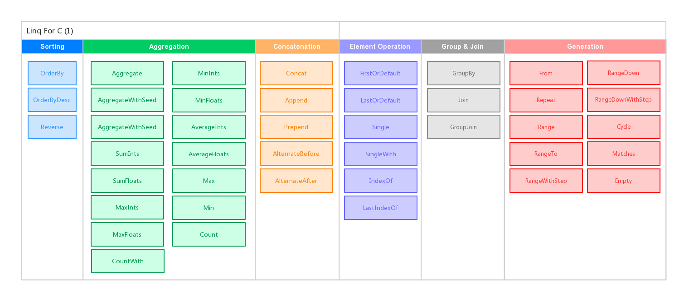
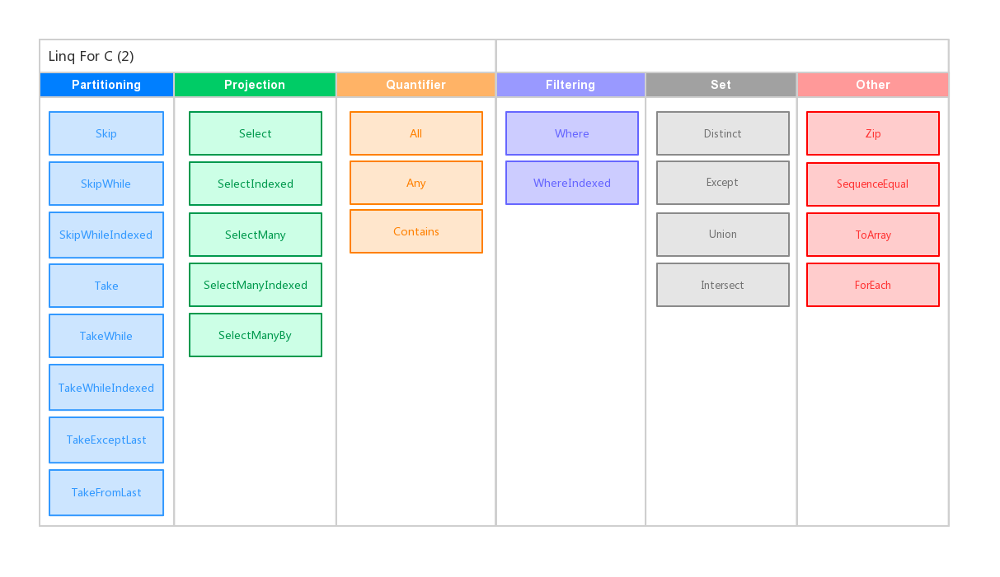

# Linq for C




## Features

- Most of the LINQ methods(50+) are supported.
- Chaining of LINQ methods are supported.
- Lambda is supported(slow).

## Examples

### Example using callbacks

```c
#include <gc.h>
#include "ArrayList.h"
#include "linq.h"

bool WhereCallback(void *item) {
    char *str= (char *)item;
    return str[0] == 'h';
}

void *SelectCallback(void *item) {
    return newStr("%s_1", (char *)item);
}

ArrayList testLinq(ArrayList array) {
    Linq *lq = From(array);

    ArrayList result =
        lq
        ->Where(lq, WhereCallback)
        ->Select(lq, SelectCallback)
        ->ToArray(lq);

    return result;
}

int main() {
    GC_INIT();

    char *str1 = "huang", *str2 = "hai", *str3 = "feng";

    ArrayList array = arrlist_new();
    arrlist_append(array, str1);
    arrlist_append(array, str2);
    arrlist_append(array, str3);

    ArrayList result = testLinq(array);
    for(int i = 0; i < arrlist_size(result); i++) {
        printf("%s\n", arrlist_get(result, i));
    }

    return 0;
}
```

### Example with lambdas

```c
ArrayList testLinq(ArrayList array) {
    Linq *lq = From(array);

    ArrayList result =
        lq
        ->Where(lq,
                lambda(bool, (void *item) {
                    char *str= (char *)item;
                    return str[0] == 'h';
                }))
        ->Select(lq,
                 lambda(void *, (void *item) {
                     return newStr("%s_1", (char *)item);
                 }))
        ->ToArray(lq);

    return result;
}

int main() {
    GC_INIT();

    char *str1 = "huang", *str2 = "hai", *str3 = "feng";

    ArrayList array = arrlist_new();
    arrlist_append(array, str1);
    arrlist_append(array, str2);
    arrlist_append(array, str3);

    ArrayList result = testLinq(array);
    for(int i = 0; i < arrlist_size(result); i++) {
        printf("%s\n", arrlist_get(result, i));
    }

    return 0;
}
```

### Example with macros

```c
#define LINQ_PTR lq

bool WhereCallback(void *item) {
    char *str= (char *)item;
    return str[0] == 'h';
}

void *SelectCallback(void *item) {
    return newStr("%s_1", (char *)item);
}

ArrayList testLinq(ArrayList array) {
    Linq *lq = From(array);

    ArrayList result =
        lq
        ->WHERE(WhereCallback)
        ->SELECT(SelectCallback)
        ->TO_ARRAY();

    return result;
}

int main(int argc, char **argv) {
    GC_INIT();

    char *str1 = "huang", *str2 = "hai", *str3 = "feng";

    ArrayList array = arrlist_new();
    arrlist_append(array, str1);
    arrlist_append(array, str2);
    arrlist_append(array, str3);

    ArrayList result = testLinq(array);
    for(int i = 0; i < arrlist_size(result); i++) {
        printf("%s\n", arrlist_get(result, i));
    }

    return 0;
}
```

## Requirement

As for the garbage collect, you need to install `Boehm GC`.

```sh
# yum install gc-devel      # RedHat family
# apt-get install libgc-dev # Debian family
```

## What's implemented

-----

- [x] Where
- [x] WhereIndexed
- [x] Select
- [x] SelectIndexed
- [x] SelectMany
- [x] SelectManyIndexed
- [x] SelectManyBy
- [x] FirstOrDefault
- [x] LastOrDefault
- [x] Take
- [x] TakeEvery
- [x] TakeWhile
- [x] TakeWhileIndexed
- [x] TakeExceptLast
- [x] TakeFromLast
- [x] Skip
- [x] SkipWhile
- [x] SkipWhileIndexed
- [x] Any
- [x] All
- [x] Reverse
- [x] IndexOf
- [x] LastIndexOf
- [x] Concat
- [x] Except
- [x] Union
- [x] Intersect
- [x] SumInts
- [x] SumFloats
- [x] MaxInts
- [x] MaxFloats
- [x] MinInts
- [x] MinFloats
- [x] AverageInts
- [x] AverageFloats
- [x] Max
- [x] Min
- [x] OrderBy
- [x] OrderByDesc
- [x] GroupBy
- [x] Zip
- [x] Single
- [x] SingleWith
- [x] Contains
- [x] Count
- [x] CountWith
- [x] JoinStr
- [x] Join
- [x] GroupJoin
- [x] Aggregate
- [x] AggregateWithSeed
- [x] AggregateWithSeedBy
- [x] SequenceEqual
- [x] Prepend
- [x] Append
- [x] ForEach
- [x] AlternateBefore
- [x] AlternateAfter
- [x] Shuffle
- [x] Slice
- [x] Pad
- [x] PadBy
- [x] Print
- [x] Println


## License

MIT
